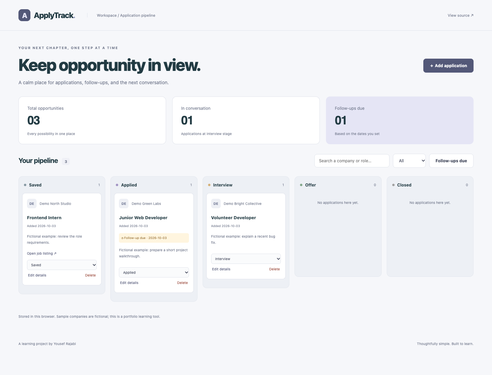

# ApplyTrack

A private-in-your-browser application board for tracking a student job search.

**A junior-level, AI-assisted portfolio learning project by Yousef Rajabi.**



[Mobile screenshot](docs/screenshots/mobile.png) · [Learning guide](docs/LEARNING.md) · [Checks](https://github.com/yousefrajabi06-debug/applytrack/actions)

Screenshots show the running application with fictional sample data. They are not design mockups. This repository does not currently advertise a hosted demo.

## Why this project

Adds a multi-stage workflow, validated external links, and follow-up dates rather than another generic to-do list.

## Features

- Create, edit, and delete job application records.
- Move records through Saved, Applied, Interview, Offer, and Closed stages.
- Use accessible stage selects instead of requiring drag and drop.
- Search company/role details, filter stages, and review follow-up dates.
- Validate external links as HTTP or HTTPS only.
- Persist records locally and optionally load clearly fictional examples.

## Tech Stack

React 19, JavaScript, Vite, CSS, localStorage, Playwright.

## Installation

Use **Node.js 24+** and npm. Install dependencies from the project directory:

```bash
git clone https://github.com/yousefrajabi06-debug/applytrack.git
cd applytrack
npm install
npm run dev
```

Open the local Vite URL printed in the terminal (normally http://127.0.0.1:5173).

No secret API keys are required. Never put credentials in frontend code. Dependencies are locked in `package-lock.json`; use `npm ci` for a reproducible clean install.

## Production build

```bash
npm run build
npm run preview
```

The build output is `dist/`. Preview is a local build check, not a hosted production service.

## Tests

```bash
npx playwright install chromium
npm test
```

If Chrome is already installed locally, macOS/Linux users can instead run `PLAYWRIGHT_CHANNEL=chrome npm test`. Browser tests use local development servers. GitHub Actions performs `npm ci`, builds the project, installs Chromium, and runs the tests on pushes and pull requests.

Three browser tests cover application creation/editing/stage changes, follow-ups, persistence, safe links, filters, empty states, and mobile layout.

## Source organization

- [`src/App.jsx`](src/App.jsx): Application state, filters, stages, and sample records.
- [`src/components/ApplicationForm.jsx`](src/components/ApplicationForm.jsx): Controlled inputs and URL/date validation.
- [`src/components/ApplicationCard.jsx`](src/components/ApplicationCard.jsx): Application summary and stage/action controls.
- [`src/lib/applications.js`](src/lib/applications.js): Allowed stages, safe URL parsing, and saved-record validation.
- [`src/hooks/useSavedState.js`](src/hooks/useSavedState.js): Local persistence and storage error handling.
- [`tests/app.spec.js`](tests/app.spec.js): Lifecycle, unsafe links, filters, persistence, and mobile checks.

## What I Learned

This AI-assisted implementation provides practice with the following concepts. These are study outcomes to work through, not a claim that every line was written independently:

- Model one application as an object with a stable ID.
- Trace a stage change from a select through immutable React state.
- Distinguish stored state from the filtered/grouped view derived from it.
- Explain why URL parsing and protocol allowlists matter for links.
- Compare date-only strings consistently for follow-up reminders.

See [the learning guide](docs/LEARNING.md) for an independent feature exercise and a rebuild plan.

## Limitations and data

No real companies or application history are preloaded. Everything is localStorage data in one browser; there is no login, synchronization, email, or automatic job submission. Browser storage is not encrypted. Synchronous local reads do not need a simulated loading screen.

The responsive UI includes visible keyboard focus and labeled controls. Browser tests are useful regression checks; they are not a complete accessibility audit. No private personal data, real credentials, generated databases, or `.env` files are committed. External Google Fonts are optional cosmetic requests; system font fallbacks keep the interface usable if fonts are unavailable.

## Future Improvements

- Export/import with validation and a backup preview.
- Optional sorting by follow-up date or last update.
- More explicit follow-up notification preferences.

## Authorship and AI assistance

Created for Yousef Rajabi's student portfolio with AI assistance in planning, implementation, testing, and documentation. Original project code was built for this portfolio; it was not copied from another GitHub application. Third-party libraries remain credited through the Tech Stack and dependency files. This is learning work, not paid client work or invented professional experience.
